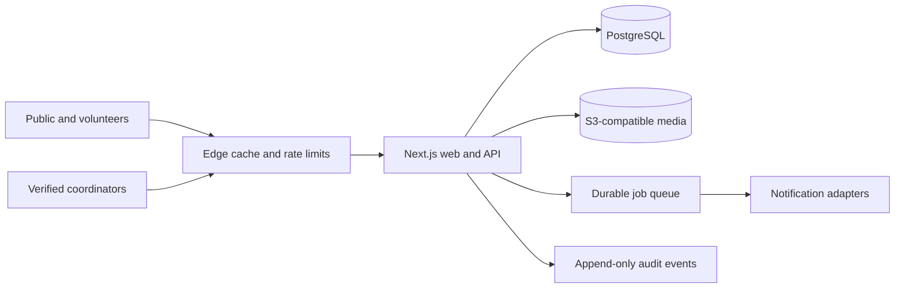

# Architecture

Open Search and Rescue is designed around one operational rule: **the lightweight field deployment is the product, not a reduced edition of it**. A family or community coordinator should be able to start one isolated incident instance with a container, while an organization can run the same application at the edge or on Kubernetes.

## Target full-stack shape

The web application owns the responsive public status experience and the authenticated coordinator workspace. Server-side route handlers expose a typed API. PostgreSQL is the source of truth for incidents, coordinator roles, updates, volunteer check-ins, and audit events. Media uses S3-compatible object storage rather than the application filesystem. Notifications are asynchronous, bounded, and optional.

## Deployment profiles

### Field instance — primary path

- One application container plus PostgreSQL, started with Docker Compose.
- One active incident per instance by default, minimizing tenancy and authorization complexity.
- Works on a small virtual machine or a capable field laptop; a secure tunnel can provide public access.
- Server-rendered, low-bandwidth public pages and installable progressive-web-app assets.
- Exportable incident archive and encrypted backups.
- Degraded mode keeps the last verified public update available when upstream services fail.

The repository currently ships the application container. PostgreSQL persistence and coordinator authentication are the next vertical slice; the public demo intentionally uses synthetic in-repository data until those controls exist.

### Managed edge

- The same container or a platform-native build behind an edge CDN and web-application firewall.
- Managed PostgreSQL and object storage.
- Cache only explicitly public, sanitized incident projections; coordinator and check-in routes are never publicly cached.
- Region pinning and retention policies configured by the operator.

### Kubernetes organization deployment

- Stateless web/API replicas with health probes, resource limits, and non-root/read-only containers.
- Managed PostgreSQL is preferred; an in-cluster database is an operator decision, not bundled into the base manifests.
- Horizontal scaling for public traffic, while background jobs use separate workers and idempotency keys.
- Network policies, external secrets, ingress/TLS, backups, and regional placement are environment overlays.

The `k8s/base` manifests are a runnable application base, not a claim that the current demo needs Kubernetes. Production overlays will be added when persistence, authentication, and worker services exist.

## Safety boundaries

- A public incident cannot become active without a verified coordinator and an identified agency of jurisdiction.
- Published updates expire automatically. An expired page switches to a safe paused state and never continues recruiting volunteers.
- Precise last-known locations, medical information, minors' data, and coordinator contact details are private by default.
- AI may summarize coordinator-approved material or flag inconsistent data; it cannot activate incidents, direct field teams, publish unreviewed updates, or contact authorities.
- Every material coordinator action produces an immutable audit event.

## Planned service boundaries

Start as a modular monolith. Extract notification or geospatial workers only when load or failure isolation justifies it. This preserves a small deployment footprint without closing the scale-up path.

Core modules will be incidents, identity and roles, publishing, team check-in, maps/assignments, notifications, and audit/retention. API schemas and database migrations are versioned so field and managed deployments can upgrade predictably.
